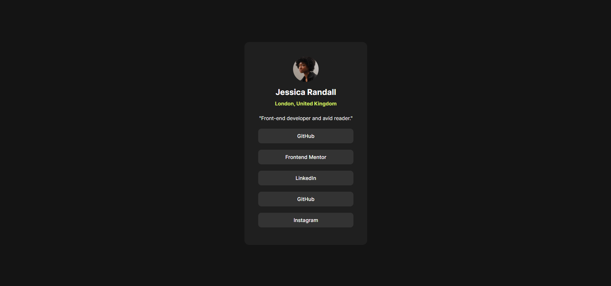

# Frontend Mentor - Social links profile solution

This is a solution to the [Social links profile challenge on Frontend Mentor](https://www.frontendmentor.io/challenges/social-links-profile-UG32l9m6dQ). Frontend Mentor challenges help you improve your coding skills by building realistic projects.

## Table of contents

- [Overview](#overview)
  - [The challenge](#the-challenge)
  - [Screenshot](#screenshot)
  - [Running the application](#running-the-application)
  - [Links](#links)
- [My process](#my-process)
  - [Built with](#built-with)
  - [What I learned](#what-i-learned)
  - [Useful resources](#useful-resources)
- [Author](#author)

## Overview

### The challenge

Users should be able to:

- See hover and focus states for all interactive elements on the page

### Screenshot



### Running the application

Run the development server:

```bash
npm run dev
```

Open [http://localhost:5138](http://localhost:5138) with your browser to see the result.

### Links

- Solution URL: [Add solution URL here](https://github.com/ingridrauany/frontendmentor/tree/main/social-links-profile)
- Live Site URL: [Add live site URL here](https://your-live-site-url.com)

## My process

### Built with

- Semantic HTML5 markup
- CSS custom properties
- Flexbox
- [Vite](https://vitejs.dev/)
- [React](https://reactjs.org/) - JS library
- [Styled Components](https://styled-components.com/) - For styles

### What I learned

A list of things that a learned or remembered when I made this first project of Frontend Mentor:

- Setup a project with: `vite`, `eslint`, `prettier`, `styled-components`, `vitest`, `testing-library`.
- Difference between `default exports` and `named exports`;
- Create a `barrel` to export components;

### Useful resources

- [Example of .editorconfig](https://github.com/facebook/react/blob/main/.editorconfig) - I use this example of `.editorconfig` from Facebook
- [Using alias](https://dev.to/tilly/aliasing-in-vite-w-typescript-1lfo) - This tutorial helps me to remember how to use alias to referencing directories
- [Setup eslint and prettier](https://dev.to/marcosdiasdev/adicionando-eslint-e-prettier-a-um-projeto-react-criado-com-vitejs-hgn) - This tutorial helps on setup eslint and prettier in my project
- [Named exports and default exports](https://www.freecodecamp.org/news/difference-between-default-and-named-exports-in-javascript/)

## Author

- Website - [Ingrid Rauany](https://ingridrauany.github.io/)
- Frontend Mentor - [@ingridrauany](https://www.frontendmentor.io/profile/ingridrauany)
